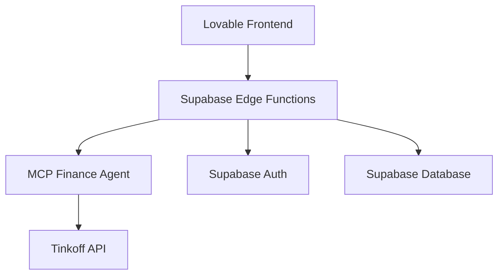
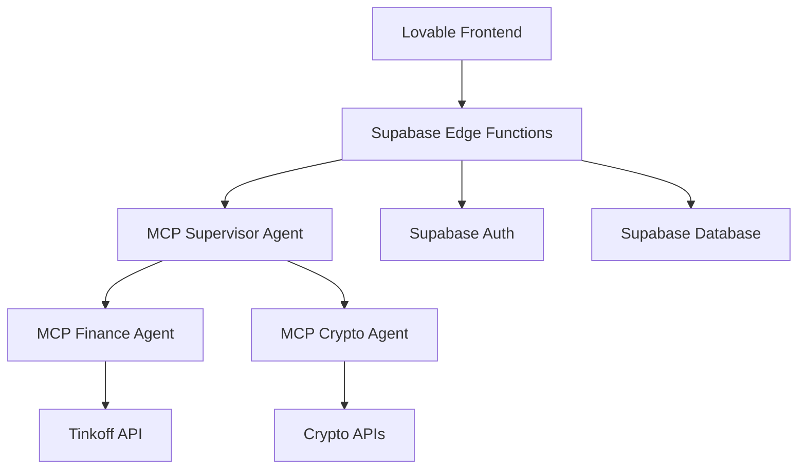

# Family Finance Chat Project

## Project Overview
An AI-powered family finance management system that helps users track and manage their investment portfolios through natural language interactions.

## Architecture

### Frontend
- Location: `/family-finance-chat`
- GitHub Repository: [family-finance-chat](https://github.com/your-username/family-finance-chat)
- Tech Stack:
  - React + TypeScript
  - Tailwind CSS
  - Supabase Client
  - React Router
  - Lucide Icons

### Backend
- Supabase Project: [family-finance-prod]
- Features:
  - Authentication
  - Real-time notifications
  - Secure token storage
  - Row Level Security
  - Edge Functions

### MCP Agent
- Location: `/`
- Configuration: `mcp.yaml`
- Features:
  - Portfolio monitoring
  - Market analysis
  - Background tasks
  - Notifications system

## Integration Points

### Supabase Integration
- Authentication
- Real-time updates
- Secure broker token storage
- User notifications
- Edge Functions for MCP agent

### MCP Agent Integration
- Portfolio monitoring
- Market analysis
- AI-powered chat
- Automated notifications

## Database Schema

### Main Tables
1. user_connections
   - Stores encrypted broker tokens
   - Manages broker connections
   - Tracks connection status

2. notifications
   - Stores user notifications
   - Tracks notification status
   - Contains portfolio alerts

## Security
- Token encryption using pgcrypto
- Row Level Security on all tables
- Secure environment variables
- Google OAuth integration

## Development Setup
1. Clone the frontend repository
2. Copy `.env.example` to `.env`
3. Set up Supabase project variables
4. Install dependencies
5. Run development server

## Deployment
- Frontend: Vercel/Netlify
- Backend: Supabase
- MCP Agent: Docker container

# План проекта: AI Banking Assistant

## Обзор
Проект по созданию AI-ассистента для управления инвестиционным портфелем через интеграцию с Tinkoff Invest API и MCP.SO.

## Фазы проекта
1. [Фаза 1: Базовая интеграция с Tinkoff API](PROJECT_PLAN_PHASE1.md) ✅
2. [Фаза 2: Разработка MCP агента](PROJECT_PLAN_PHASE2.md) ✅
3. [Фаза 3: Интеграция с Lovable](PROJECT_PLAN_PHASE3.md) 🔄
4. [Фаза 4: Расширение функциональности](PROJECT_PLAN_PHASE4.md) ⏳

## Текущий статус
Мы находимся в Фазе 3: Интеграция с Lovable. Завершена настройка авторизации через Supabase, следующий шаг - создание Edge Function с мок-ответами.

## Архитектура системы
[См. детальное описание архитектуры в PROJECT_PLAN_PHASE3.md]

## Логический долг
[См. список технического долга в соответствующих файлах фаз]

# MCP Finance Agent - Project Plan

## Прогресс разработки
🟢 Общий прогресс: 35%

По основным направлениям:
- Базовая инфраструктура: 90% ✓
- Интеграция с API: 70% ✓
- Анализ портфеля: 40% 🟡
- Торговые операции: 0% 🔴
- Мониторинг и уведомления: 10% 🟡
- Автоматизация: 5% 🔴

## Overview
MCP Finance Agent - это интеллектуальный агент для автоматизации работы с Тинькофф Инвестиции API. 
Агент предоставляет расширенные возможности для анализа инструментов, управления портфелем и автоматизации торговых стратегий.

## Функциональные возможности

### 1. Работа с инструментами
- [x] Получение списка всех доступных инструментов (акции, облигации, ETF)
- [x] Детальная информация по каждому инструменту
- [x] Анализ ликвидности через стакан заявок
- [x] История дивидендных выплат для акций
- [x] График купонных выплат для облигаций
- [x] Расчет НКД для облигаций
- [ ] Технический анализ (индикаторы, паттерны)
- [ ] Фундаментальный анализ
- [ ] Интеграция с внешними источниками данных

### 2. Анализ портфеля
- [x] Получение текущего состава портфеля
- [x] Расчет базовых метрик
- [~] Расчет метрик риска (требует доработки)
- [~] Анализ диверсификации (базовый уровень)
- [ ] Оптимизация портфеля
- [ ] Ребалансировка
- [ ] Отчетность и аналитика

### 3. Торговые операции
- [ ] Выставление заявок
- [ ] Отмена заявок
- [ ] Модификация заявок
- [ ] Стоп-заявки
- [ ] Условные заявки

### 4. Мониторинг и уведомления
- [ ] Отслеживание цен
- [ ] Алерты по техническим индикаторам
- [ ] Уведомления о корпоративных событиях
- [ ] Отчеты о состоянии портфеля

### 5. Автоматизация
- [ ] Автоматическое исполнение торговых стратегий
- [ ] Периодическая ребалансировка портфеля
- [ ] Автоматический сбор и анализ данных
- [ ] Интеграция с внешними системами

## Технические характеристики

### API и интеграции
- [x] Tinkoff Invest API
- [ ] Внешние источники рыночных данных
- [ ] Новостные API
- [ ] Аналитические сервисы

### Анализ данных
- [x] Расчет метрик ликвидности
- [x] Анализ риска
- [ ] Машинное обучение для прогнозирования
- [ ] Обработка временных рядов

### Безопасность
- [x] Безопасное хранение учетных данных
- [ ] Логирование операций
- [ ] Контроль доступа
- [ ] Аудит действий

## Дорожная карта

### Фаза 1 - Базовая функциональность (Текущая)
- [x] Интеграция с Tinkoff API
- [x] Получение информации об инструментах
- [x] Базовый анализ портфеля
- [x] Работа с рыночными данными

### Фаза 2 - Расширенный анализ
- [ ] Технический анализ
- [ ] Фундаментальный анализ
- [ ] Оптимизация портфеля
- [ ] Система уведомлений

### Фаза 3 - Автоматизация
- [ ] Торговые стратегии
- [ ] Автоматическая ребалансировка
- [ ] Интеграция с внешними источниками
- [ ] Расширенная отчетность

### Фаза 4 - Масштабирование
- [ ] API для внешних систем
- [ ] Многопользовательский режим
- [ ] Расширенные инструменты анализа
- [ ] Интеграция с дополнительными брокерами

### Фаза 5 - Интеграция крипто
- [ ] Выбор или разработка MCP Crypto Agent
- [ ] Интеграция с криптобиржами
- [ ] Базовая аналитика крипто портфеля
- [ ] Мониторинг крипто активов

### Фаза 6 - Supervisor Agent
- [ ] Разработка MCP Supervisor Agent
- [ ] Логика маршрутизации запросов
- [ ] Агрегация данных из агентов
- [ ] Единый интерфейс портфеля

### Фаза 7 - Кросс-активная аналитика
- [ ] Общие метрики портфеля
- [ ] Анализ корреляций между активами
- [ ] Рекомендации по балансировке
- [ ] Управление рисками портфеля

## Важные архитектурные решения

### Изоляция слоев и зависимостей
1. Сервисы внешних API (`src/services/`) должны быть полностью изолированы от остальной системы:
   - Собственные модели данных
   - Минимальные зависимости
   - Отсутствие прямых зависимостей от внешних SDK (например, tinkoff-investments)
   
2. Причины такого решения:
   - Конфликты версий зависимостей (например, pydantic v1 vs v2)
   - Упрощение тестирования и мокирования
   - Возможность легкой замены реализации
   - Контроль над обработкой ошибок и форматом данных

3. Реализация:
   - Использование базовых HTTP клиентов (aiohttp)
   - Собственные модели данных для каждого слоя
   - Адаптеры для преобразования данных между слоями
   - Четкие интерфейсы взаимодействия

## Статусы
- 🔴 Не начато
- 🟡 В работе
- 🟢 Сделано

## Общая архитектура системы

### Текущая архитектура (v1)

#### Компоненты:
1. **Lovable Frontend**
   - React приложение
   - Хостинг на Lovable
   - Компоненты для чата и визуализации портфеля
   - Интеграция с Supabase Auth

2. **Supabase**
   - Auth: Аутентификация и авторизация пользователей
   - Database: Хранение истории чата и настроек
   - Edge Functions: Прокси между фронтендом и MCP агентом
   - Безопасное хранение токенов и ключей

3. **MCP Finance Agent**
   - Хостинг на MCP.SO
   - Обработка запросов через HTTP API
   - Взаимодействие с Tinkoff API
   - Анализ портфеля и генерация ответов

### Целевая архитектура (v2)

#### Компоненты v2:
1. **MCP Supervisor Agent**
   - Хостинг на MCP.SO
   - Оркестрация запросов между агентами
   - Агрегация данных из разных источников
   - Единый интерфейс для работы с портфелем

2. **MCP Finance Agent** (Существующий)
   - Хостинг на MCP.SO
   - Работа с Tinkoff API
   - Анализ традиционного портфеля
   - Метрики и аналитика по акциям/облигациям

3. **MCP Crypto Agent** (Планируемый)
   - Хостинг на MCP.SO
   - Интеграция с криптобиржами
   - Анализ крипто портфеля
   - Метрики и аналитика по криптоактивам

4. **Единый портфель**
   - Агрегация позиций из разных источников
   - Общая оценка рисков
   - Кросс-активная аналитика
   - Балансировка между традиционными и крипто активами

### Целевая архитектура (v3)

#### Компоненты v3:
1. **MCP Supervisor Agent**
   - Хостинг на MCP.SO
   - Оркестрация запросов между агентами
   - Агрегация данных из разных источников
   - Единый интерфейс для работы с портфелем

2. **MCP Finance Agent** (Существующий)
   - Хостинг на MCP.SO
   - Работа с Tinkoff API
   - Анализ традиционного портфеля
   - Метрики и аналитика по акциям/облигациям

3. **MCP Crypto Agent** (Планируемый)
   - Хостинг на MCP.SO
   - Интеграция с криптобиржами
   - Анализ крипто портфеля
   - Метрики и аналитика по криптоактивам

4. **Единый портфель**
   - Агрегация позиций из разных источников
   - Общая оценка рисков
   - Кросс-активная аналитика
   - Балансировка между традиционными и крипто активами

## Дорожная карта v3
### Фаза 5 - Интеграция крипто
- [ ] Выбор или разработка MCP Crypto Agent
- [ ] Интеграция с криптобиржами
- [ ] Базовая аналитика крипто портфеля
- [ ] Мониторинг крипто активов

### Фаза 6 - Supervisor Agent
- [ ] Разработка MCP Supervisor Agent
- [ ] Логика маршрутизации запросов
- [ ] Агрегация данных из агентов
- [ ] Единый интерфейс портфеля

### Фаза 7 - Кросс-активная аналитика
- [ ] Общие метрики портфеля
- [ ] Анализ корреляций между активами
- [ ] Рекомендации по балансировке
- [ ] Управление рисками портфеля

## План разработки

### Этап 1: Подготовка и планирование ✓
- [x] Определение требований и целей
- [x] Выбор технологий и инструментов
- [x] Создание структуры проекта
- [x] Настройка окружения разработки

#### 1.1 Настройка проекта
- [x] Инициализация Poetry проекта
- [x] Настройка зависимостей
- [x] Настройка pre-commit хуков
- [x] Настройка линтеров и форматтеров

#### 1.2 Базовая структура MCP
- [x] Реализация базового MCP протокола
- [x] Создание Context Manager
- [x] Создание Tool Registry
- [x] Базовая обработка сообщений
  - [x] Создание MessageHandler
  - [x] Реализация базовой логики обработки
  - [x] Реализация анализа сообщений
    - [x] Создание MessageAnalyzer
    - [x] Паттерны для определения типов инструментов
    - [x] Тесты для анализатора сообщений
  - [x] Реализация выполнения инструментов
    - [x] Создание базового класса инструмента
    - [x] Создание исполнителя инструментов
    - [x] Интеграция с MessageHandler
    - [x] Тесты для базовых компонентов
  - [x] Реализация генерации ответов
    - [x] Базовая логика форматирования
    - [x] Обработка ошибок
    - [x] Контекстные ответы

#### 1.3 Тестирование базового функционала
- [x] Unit тесты для Context Manager
- [x] Unit тесты для Tool Registry
- [x] Unit тесты для Message Handler
- [x] Unit тесты для Message Analyzer
- [x] Unit тесты для Tool Base и Executor
- [x] Интеграционные тесты базового протокола
  - [x] Тесты потока обработки сообщений
  - [x] Тесты взаимодействия компонентов
  - [x] Тесты обработки ошибок
- [x] Документация по тестированию
  - [x] Структура тестов
  - [x] Описание компонентов
  - [x] Инструкции по запуску
  - [x] Best practices

### Этап 2: Интеграция с Tinkoff API

#### 2.1 Клиент Tinkoff API ✓
- [x] Базовый HTTP клиент на aiohttp
  - [x] Конфигурация таймаутов и политик повторных попыток
  - [x] Обработка rate limit
  - [x] Централизованная обработка ошибок
  - [x] Кэширование в памяти с TTL
  - [x] Мониторинг hit/miss ratio

#### 2.2 Базовые инструменты ✓
- [x] Получение портфеля
  - [x] Список счетов
  - [x] Текущие позиции
  - [x] Доступные валюты
  - [~] Расчет стоимости в разных валютах (базовый уровень)
- [x] Получение операций
  - [x] Фильтрация по типам
  - [x] Фильтрация по периоду
  - [x] Группировка по инструментам
- [x] Получение рыночных данных
  - [x] Текущие цены
  - [x] Исторические данные
  - [x] Свечи разных таймфреймов
- [x] Обработка стримов
  - [x] Подписка на события
  - [x] Обработка обновлений
  - [x] Восстановление соединения

#### 2.3 Тестирование интеграции
- [x] Unit тесты
  - [x] Тесты HTTP клиента
  - [x] Тесты кэширования
  - [x] Тесты обработки ошибок
- [x] Интеграционные тесты
  - [x] Тесты работы с API
  - [x] Тесты стриминга
  - [x] Тесты восстановления

### Этап 3: Аналитические инструменты

#### 3.1 Базовая аналитика
- [ ] Расчет метрик портфеля
  - [ ] Доходность (абсолютная/относительная)
  - [ ] Волатильность
  - [ ] Корреляции
  - [ ] Риск-метрики (VaR, CVaR)
- [ ] Анализ операций
  - [ ] Прибыль/убыток по сделкам
  - [ ] Статистика по типам операций
  - [ ] Распределение по секторам/классам
- [ ] Технический анализ
  - [ ] Индикаторы тренда
  - [ ] Осцилляторы
  - [ ] Уровни поддержки/сопротивления

#### 3.2 Продвинутая аналитика
- [ ] Оптимизация портфеля
  - [ ] Modern Portfolio Theory
  - [ ] Efficient Frontier
  - [ ] Rebalancing рекомендации
- [ ] Риск-анализ
  - [ ] Stress testing
  - [ ] Scenario analysis
  - [ ] Factor analysis
- [ ] Прогнозирование
  - [ ] ML модели
  - [ ] Backtesting
  - [ ] Validation

### Этап 4: Пользовательский интерфейс

#### 4.1 CLI интерфейс
- [ ] Базовые команды
  - [ ] Просмотр портфеля
  - [ ] Просмотр операций
  - [ ] Просмотр метрик
- [ ] Интерактивный режим
  - [ ] Навигация
  - [ ] Фильтрация
  - [ ] Форматирование
- [ ] Визуализация
  - [ ] Графики
  - [ ] Таблицы
  - [ ] Экспорт данных

#### 4.2 Web интерфейс
- [ ] Базовый функционал
  - [ ] Авторизация
  - [ ] Просмотр портфеля
  - [ ] Просмотр операций
- [ ] Аналитика
  - [ ] Дашборды
  - [ ] Отчеты
  - [ ] Уведомления
- [ ] Управление
  - [ ] Настройки
  - [ ] Профили
  - [ ] Экспорт/импорт

#### 4.3 Интеграция AI Chat с MCP агентом

##### Архитектура решения
- [x] Фронтенд: Lovable хостинг
- [x] База данных и Edge Functions: Supabase Cloud
- [x] MCP агент: MCP.SO
- [x] Коммуникация: HTTPS с авторизацией

##### План интеграции
- [ ] Настройка Supabase
  - [ ] Создание таблиц для хранения истории чата
  - [ ] Настройка политик безопасности
  - [ ] Создание Edge Function для проксирования запросов
- [ ] Настройка MCP агента
  - [ ] Подготовка к публикации
    - [ ] Создание mcp.yaml конфигурации
    - [ ] Проверка зависимостей
    - [ ] Настройка entry points
  - [ ] Публикация на MCP.SO
    - [ ] Инициализация проекта на MCP.SO
    - [ ] Загрузка секретов (TINKOFF_TOKEN, REDIS_URL)
    - [ ] Деплой агента
    - [ ] Проверка health endpoint
  - [ ] Настройка мониторинга
    - [ ] Подключение логирования
    - [ ] Настройка алертов
    - [ ] Мониторинг метрик
- [ ] Интеграция фронтенда
  - [ ] Модификация AIChat компонента
  - [ ] Добавление обработки ошибок
  - [ ] Улучшение UX при загрузке ответов
- [ ] Тестирование и мониторинг
  - [ ] Сквозное тестирование интеграции
  - [ ] Настройка логирования
  - [ ] Мониторинг производительности

##### Безопасность
- [ ] Авторизация между компонентами
  - [ ] Токены Supabase
  - [ ] API ключи MCP.SO
  - [ ] Защита Edge Functions
- [ ] Валидация данных
  - [ ] Проверка входных данных
  - [ ] Санитизация ответов
  - [ ] Ограничение размера сообщений

## Следующие действия

### План интеграции с AI Chat (Текущий приоритет)
1. Настройка авторизации через Supabase на фронте
   - [ ] Создание Auth UI компонентов
   - [ ] Настройка Auth провайдеров
   - [ ] Управление сессиями

2. Создание базовой Edge Function с мок-ответами
   - [ ] Создание структуры ответов
   - [ ] Имплементация базовых эндпоинтов
   - [ ] Добавление моков для портфеля

3. Реализация UI для чата и отображения портфеля
   - [ ] Компонент чата
   - [ ] Визуализация портфеля
   - [ ] Состояния загрузки и ошибок

4. Тестирование flow с моками
   - [ ] End-to-end тесты
   - [ ] Тестирование edge cases
   - [ ] Оптимизация UX

5. Публикация агента на MCP.SO
   - [ ] Финальная подготовка агента
   - [ ] Деплой на MCP.SO
   - [ ] Настройка мониторинга

6. Интеграция реального агента в Edge Function
   - [ ] Замена моков на реальные вызовы
   - [ ] Обработка ошибок
   - [ ] Кэширование

7. End-to-end тестирование
   - [ ] Проверка всех сценариев
   - [ ] Нагрузочное тестирование
   - [ ] Мониторинг производительности

## Логический долг

### Инфраструктура и DevOps
- [ ] CI/CD пайплайны
- [ ] Автоматизация деплоя
- [ ] Мониторинг и алертинг
- [ ] Управление секретами

### Тестирование
- [ ] Расширение unit тестов
- [ ] Интеграционные тесты
- [ ] E2E тесты
- [ ] Performance тесты

### Документация
- [ ] API документация
- [ ] Руководство по развертыванию
- [ ] Документация для разработчиков
- [ ] Пользовательская документация

### Безопасность
- [ ] Аудит безопасности
- [ ] Penetration testing
- [ ] Compliance проверки
- [ ] Security hardening

### Оптимизация
- [ ] Профилирование производительности
- [ ] Оптимизация запросов
- [ ] Кэширование
- [ ] Масштабирование

## Текущий статус
- Дата начала: 02.04.2024
- Текущий этап: 1.1 Настройка проекта и 1.2 Базовая структура MCP
- Статус: 🟡 В работе

## История обновлений
- 02.04.2024 - Создан проектный план
- 02.04.2024 - Добавлены разделы Supabase, Lovable Frontend и Agent Supervisor
- 02.04.2024 - Реализована базовая структура MCP агента
- 02.04.2024 - Добавлены pre-commit хуки и тесты для базовых компонентов
- 02.04.2024 - Реализован базовый обработчик сообщений с тестами
- 02.04.2024 - Добавлен анализатор сообщений с поддержкой паттернов
- 02.04.2024 - Реализована система выполнения инструментов с тестами
- 02.04.2024 - Добавлены интеграционные тесты и документация 