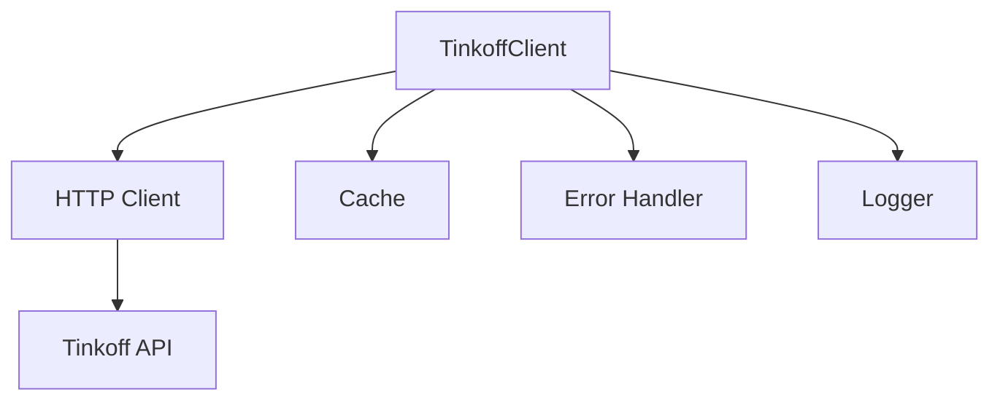

# Фаза 1: Базовая интеграция с Tinkoff API

## Цель
Создание базового клиента для работы с Tinkoff Invest API и получение основных данных портфеля.

## Архитектура


### Компоненты
1. **TinkoffClient**
   - Базовый класс для работы с API
   - Управление сессиями и токенами
   - Обработка запросов и ответов

2. **HTTP Client**
   - Настроенные таймауты и политики повторных попыток
   - Обработка rate limit
   - Кэширование в памяти с TTL

3. **Cache**
   - In-memory кэш с TTL
   - Мониторинг hit/miss ratio
   - Стратегии инвалидации

4. **Error Handler**
   - Централизованная обработка ошибок
   - Классификация ошибок
   - Логирование и мониторинг

## Структура файлов
```
src/
├── services/
│   └── tinkoff/
│       ├── client.py          # Основной клиент
│       ├── http.py            # HTTP клиент
│       ├── cache.py           # Кэширование
│       ├── errors.py          # Обработка ошибок
│       └── models.py          # Модели данных
├── tests/
│   └── services/
│       └── tinkoff/
│           ├── test_client.py
│           ├── test_http.py
│           ├── test_cache.py
│           └── test_errors.py
└── utils/
    └── logging.py             # Настройка логирования
```

## Задачи
- [x] Настройка окружения
  - [x] Создание виртуального окружения
  - [x] Установка зависимостей
  - [x] Настройка линтеров и форматтеров

- [x] Разработка Tinkoff клиента
  - [x] Базовый класс для работы с API
  - [x] Методы для получения данных портфеля
  - [x] Обработка ошибок и логирование

- [x] Тестирование
  - [x] Unit тесты для клиента
  - [x] Интеграционные тесты с реальным API
  - [x] Тестирование обработки ошибок

## Результаты
- [x] Рабочий клиент для Tinkoff API
- [x] Набор тестов
- [x] Документация по использованию

## Статус
✅ Завершено 