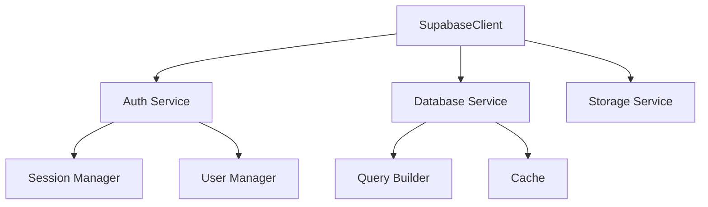

# Фаза 2: Интеграция с Supabase

## Цель
Создание сервиса для работы с Supabase и реализация базовой аутентификации.

## Архитектура


### Компоненты
1. **SupabaseClient**
   - Основной класс для работы с Supabase
   - Управление подключениями
   - Конфигурация и инициализация

2. **Auth Service**
   - Аутентификация пользователей
   - Управление сессиями
   - Работа с JWT токенами

3. **Database Service**
   - CRUD операции
   - Query Builder
   - Кэширование запросов

4. **Storage Service**
   - Работа с файлами
   - Управление бакетами
   - ACL и права доступа

## Структура файлов
```
src/
├── services/
│   └── supabase/
│       ├── client.py          # Основной клиент
│       ├── auth.py            # Аутентификация
│       ├── database.py        # Работа с БД
│       ├── storage.py         # Работа с файлами
│       └── models.py          # Модели данных
├── tests/
│   └── services/
│       └── supabase/
│           ├── test_client.py
│           ├── test_auth.py
│           ├── test_database.py
│           └── test_storage.py
└── config/
    └── supabase.py           # Конфигурация
```

## Задачи
- [x] Настройка Supabase
  - [x] Создание проекта
  - [x] Настройка аутентификации
  - [x] Создание базовых таблиц

- [x] Разработка клиента
  - [x] Базовый класс для работы с Supabase
  - [x] Реализация аутентификации
  - [x] Работа с базой данных

- [x] Тестирование
  - [x] Unit тесты для клиента
  - [x] Интеграционные тесты
  - [x] Тестирование аутентификации

## Результаты
- [x] Рабочий клиент для Supabase
- [x] Реализованная аутентификация
- [x] Набор тестов
- [x] Документация по использованию

## Статус
✅ Завершено 