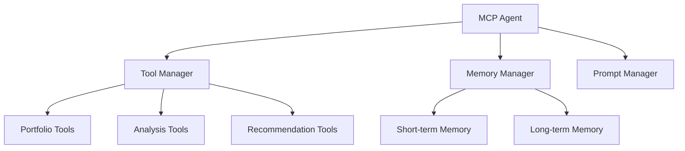

# Фаза 3: Разработка MCP агента

## Цель
Создание MCP агента для анализа портфеля и предоставления рекомендаций.

## Архитектура


### Компоненты
1. **MCP Agent**
   - Основной класс агента
   - Управление инструментами
   - Обработка запросов

2. **Tool Manager**
   - Регистрация инструментов
   - Управление доступом
   - Выполнение инструментов

3. **Memory Manager**
   - Краткосрочная память (сессия)
   - Долгосрочная память (история)
   - Векторное хранилище

4. **Prompt Manager**
   - Шаблоны промптов
   - Динамическая генерация
   - Контекстная информация

## Структура файлов
```
src/
├── agent/
│   ├── core/
│   │   ├── agent.py          # Основной класс агента
│   │   ├── tools.py          # Менеджер инструментов
│   │   ├── memory.py         # Менеджер памяти
│   │   └── prompts.py        # Менеджер промптов
│   ├── tools/
│   │   ├── portfolio.py      # Инструменты портфеля
│   │   ├── analysis.py       # Инструменты анализа
│   │   └── recommendations.py # Инструменты рекомендаций
│   └── memory/
│       ├── short_term.py     # Краткосрочная память
│       └── long_term.py      # Долгосрочная память
├── tests/
│   └── agent/
│       ├── test_agent.py
│       ├── test_tools.py
│       ├── test_memory.py
│       └── test_prompts.py
└── config/
    └── agent.py             # Конфигурация агента
```

## Задачи
- [x] Разработка базового агента
  - [x] Создание структуры проекта
  - [x] Настройка конфигурации
  - [x] Реализация базового функционала

- [x] Создание инструментов
  - [x] PortfolioInfoTool
  - [x] PortfolioPerformanceTool
  - [x] PortfolioPnLTool
  - [x] PortfolioCashFlowTool

- [x] Тестирование
  - [x] Unit тесты для инструментов
  - [x] Интеграционные тесты с Tinkoff API
  - [x] Тестирование обработки ошибок

## Результаты
- [x] Рабочий MCP агент
- [x] Набор инструментов для анализа портфеля
- [x] Тесты и документация

## Статус
✅ Завершено 