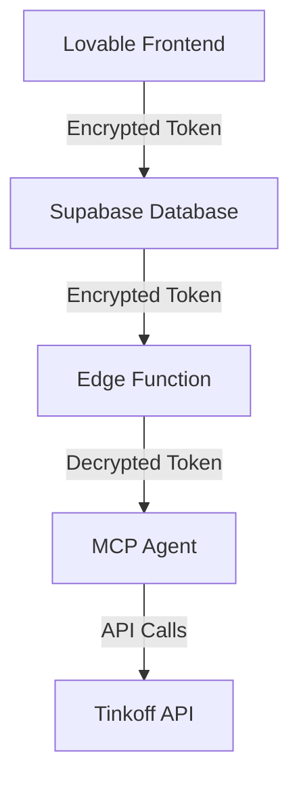
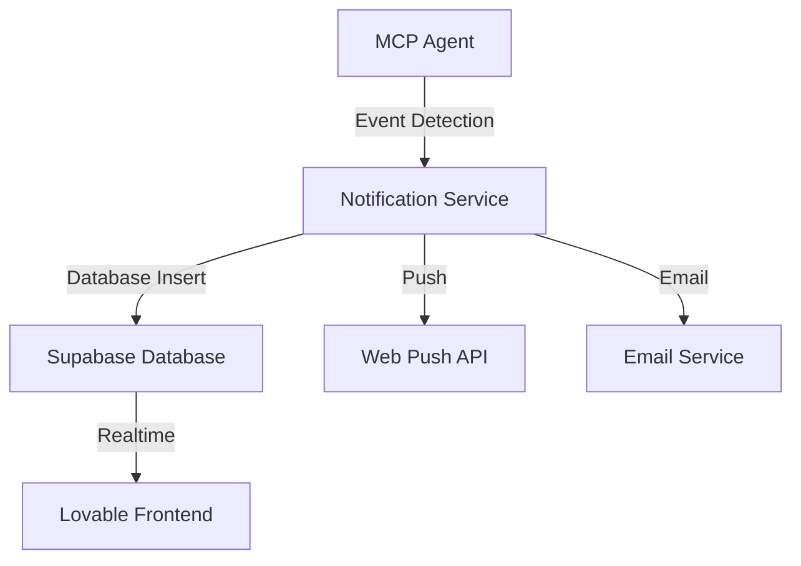

# Фаза 4: Расширение функциональности

## Цель
Интеграция MCP агента с Lovable через Supabase Edge Functions, реализация безопасного хранения токенов и системы уведомлений.

## Архитектура

### Хранение токенов


1. **Безопасное хранение**
   - Таблица `user_tokens` в Supabase с RLS
   - Шифрование токенов через pgcrypto
   - Доступ только через Edge Functions

2. **Схема таблицы `user_tokens`**
```sql
CREATE TABLE user_tokens (
    id UUID PRIMARY KEY DEFAULT uuid_generate_v4(),
    user_id UUID REFERENCES auth.users(id),
    broker_type TEXT NOT NULL,
    encrypted_token TEXT NOT NULL,
    created_at TIMESTAMPTZ DEFAULT NOW(),
    updated_at TIMESTAMPTZ DEFAULT NOW(),
    is_active BOOLEAN DEFAULT true
);

-- RLS политики
ALTER TABLE user_tokens ENABLE ROW LEVEL SECURITY;
CREATE POLICY "Users can only view their own tokens"
    ON user_tokens FOR SELECT
    USING (auth.uid() = user_id);
```

### Система уведомлений



1. **Типы уведомлений**
   - Изменения в портфеле (>5%)
   - Достижение целевых цен
   - Корпоративные события
   - Риск-алерты
   - Рекомендации по ребалансировке

2. **Схема таблицы `notifications`**
```sql
CREATE TABLE notifications (
    id UUID PRIMARY KEY DEFAULT uuid_generate_v4(),
    user_id UUID REFERENCES auth.users(id),
    type TEXT NOT NULL,
    title TEXT NOT NULL,
    message TEXT NOT NULL,
    metadata JSONB,
    is_read BOOLEAN DEFAULT false,
    created_at TIMESTAMPTZ DEFAULT NOW()
);

-- RLS политики
ALTER TABLE notifications ENABLE ROW LEVEL SECURITY;
CREATE POLICY "Users can only view their own notifications"
    ON notifications FOR SELECT
    USING (auth.uid() = user_id);
```

3. **Каналы доставки**
   - In-app уведомления через Supabase Realtime
   - Web Push уведомления
   - Email уведомления (опционально)

## Компоненты системы

### 1. Frontend (Lovable)
- Форма ввода токена с шифрованием на клиенте
- Компонент управления уведомлениями
- Настройки каналов доставки
- Отображение истории уведомлений

### 2. Backend (Supabase)
- Таблицы для токенов и уведомлений
- Edge Functions для работы с MCP агентом
- Realtime каналы для уведомлений
- Шифрование данных

### 3. MCP Agent
- Мониторинг портфеля в фоновом режиме
- Детекция событий для уведомлений
- Отправка уведомлений через API
- Периодическая валидация токенов

## План реализации

### 1. Безопасное хранение токенов
- [x] Создание таблицы `user_tokens`
- [x] Настройка шифрования через pgcrypto
- [x] Реализация RLS политик
- [x] Интеграция с Edge Functions

### 2. Система уведомлений
- [x] Создание таблицы `notifications`
- [x] Настройка Realtime каналов
- [x] Интеграция Web Push API
- [x] Настройка Email сервиса

### 3. Мониторинг портфеля
- [x] Реализация фоновых задач в MCP агенте
- [x] Настройка правил для генерации уведомлений
- [x] Интеграция с системой уведомлений
- [ ] Тестирование различных сценариев

### 4. Frontend интеграция
- [x] Компонент ввода и управления токеном
- [x] UI для уведомлений
- [x] Настройки пользователя
- [ ] Тестирование UX

## Важные заметки по реализации

### Управление зависимостями
Для предотвращения конфликтов зависимостей:

1. **Единый MCP агент**:
   - Tinkoff API уже интегрирован в MCP агента через `TinkoffAgent` класс
   - Все необходимые инструменты (portfolio, market data) уже реализованы
   - Токены и уведомления будут управляться через Supabase

2. **Взаимодействие компонентов**:
   - MCP агент работает с Tinkoff API через абстракцию `TinkoffClient`
   - Supabase используется для:
     - Хранения и управления токенами
     - Системы уведомлений через Realtime
     - Хранения настроек пользователя

3. **Деплой на MCP.SO**:
   - Развертывание единого MCP агента
   - Интеграция с Supabase для токенов и уведомлений
   - Настройка WebSocket для real-time уведомлений

## Безопасность

### Хранение токенов
- Шифрование на уровне базы данных
- Доступ только через Edge Functions
- Регулярная ротация ключей шифрования
- Аудит доступа к токенам

### Уведомления
- Проверка авторизации для каждого канала
- Валидация отправителя
- Ограничение частоты уведомлений
- Защита от спама

## Метрики и мониторинг
- Время доставки уведомлений
- Статистика по каналам доставки
- Активность пользователей
- Ошибки и сбои

## Следующие шаги
1. [x] Создание таблиц в Supabase
2. [x] Настройка шифрования токенов
3. [x] Реализация базового мониторинга
4. [ ] Деплой на MCP.SO:
   - [ ] Настройка окружения для MCP агента
   - [ ] Интеграция с Supabase
   - [ ] Тестирование в family-finance-chat 