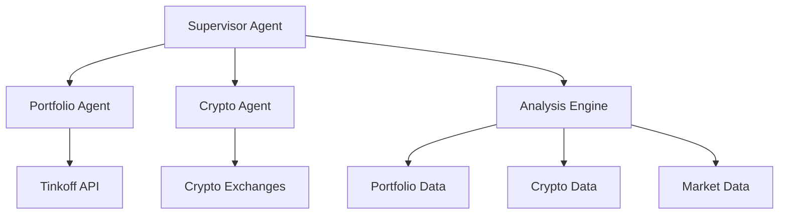

# Фаза 5: Расширение функциональности

## Цель
Расширение функциональности системы за счет добавления крипто-агента и супервайзера.

## Архитектура


### Компоненты
1. **Supervisor Agent**
   - Агрегация данных
   - Управление агентами
   - Принятие решений
   - Мониторинг

2. **Portfolio Agent**
   - Анализ традиционных активов
   - Работа с Tinkoff API
   - Генерация рекомендаций

3. **Crypto Agent**
   - Анализ криптоактивов
   - Работа с биржами
   - Мониторинг рынка

4. **Analysis Engine**
   - Корреляционный анализ
   - Оптимизация портфеля
   - Риск-менеджмент
   - Ребалансировка

## Структура файлов
```
src/
├── agents/
│   ├── supervisor/
│   │   ├── agent.py
│   │   ├── manager.py
│   │   └── monitor.py
│   ├── crypto/
│   │   ├── agent.py
│   │   ├── exchanges.py
│   │   └── analysis.py
│   └── portfolio/
│       ├── agent.py
│       └── analysis.py
├── analysis/
│   ├── engine.py
│   ├── correlation.py
│   ├── optimization.py
│   └── risk.py
├── tests/
│   ├── agents/
│   └── analysis/
└── config/
    └── agents.py
```

## Задачи
- [ ] Интеграция крипто-агента
  - [ ] Выбор/разработка крипто-агента
  - [ ] Настройка интеграции с крипто-биржами
  - [ ] Тестирование функциональности

- [ ] Разработка Supervisor агента
  - [ ] Создание базовой структуры
  - [ ] Реализация агрегации данных
  - [ ] Настройка коммуникации с агентами

- [ ] Кросс-активная аналитика
  - [ ] Анализ корреляций
  - [ ] Оптимизация портфеля
  - [ ] Рекомендации по ребалансировке

## Результаты
- [ ] Интегрированный крипто-агент
- [ ] Рабочий Supervisor агент
- [ ] Система кросс-активной аналитики

## Статус
⏳ Запланировано 